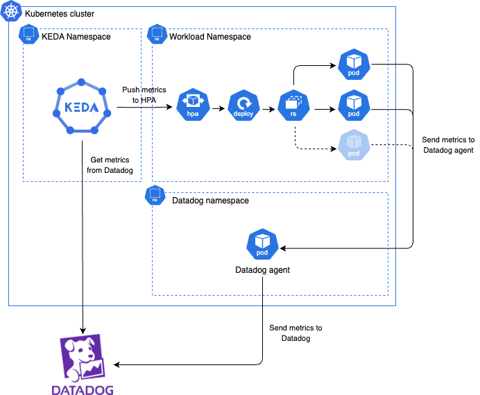
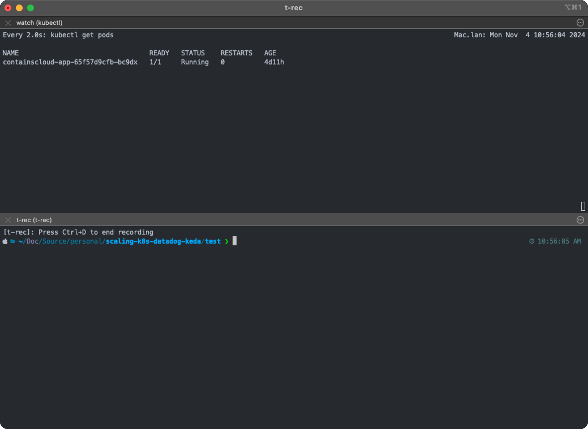
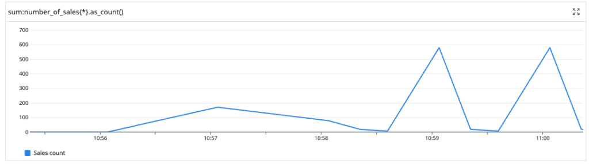

# Scaling beyond the technical with KEDA and Datadog

📄 The files available in this repository are from the "Scaling beyond the technical with KEDA and Datadog" blog post of [contains(cloud)](https://containscloud.com/) ☁️

# Architecture


# How to run the demo

## Pre-requirements
* A Kubernetes cluster. In case you don’t have one, you can use the [eks-lab-cluster](https://github.com/diego7marques/eks-lab-cluster) available on my GitHub.
* An [API and Application Key](https://docs.datadoghq.com/account_management/api-app-keys/) of your Datadog account.
* [k6](https://k6.io/) installed 

## Setup
1. Install KEDA
    ```sh
    ## Installing KEDA
    helm repo add kedacore https://kedacore.github.io/charts
    helm repo update
    helm install keda kedacore/keda --namespace keda --create-namespace
    ```

2. Install Datadog Operator and Agent
    ```sh
    ## Add environment variable
    export DD_API_KEY="<YOUR_DATADOG_API_KEY>"

    ## Install datadog-operator using helm
    helm repo add datadog https://helm.datadoghq.com
    helm install datadog-operator datadog/datadog-operator -n datadog --create-namespace
    kubectl create secret generic datadog-secret --from-literal api-key=$DD_API_KEY -n datadog

    ## Install DatadogAgent with otel endpoint available
    kubectl apply -f https://raw.githubusercontent.com/diego7marques/scaling-k8s-datadog-keda/refs/heads/main/k8s/datadog/datadog-agent.yaml
    ```

3. Deploy App and Scaler:
    ```sh
    ## Add environment variables
    export DD_API_KEY="<YOUR_DATADOG_API_KEY>" \
    export DD_APP_KEY="<YOUR_DATADOG_API_KEY>" \
    export DD_SITE="datadoghq.com"

    ## Create a secret to KEDA authenticate with Datadog
    kubectl create secret generic datadog-secrets \
    --namespace=containscloud-demo \
    --from-literal=apiKey=$DD_API_KEY \
    --from-literal=appKey=$DD_APP_KEY \
    --from-literal=datadogSite=$DD_SITE

    ## Apply the app yaml
    kubectl apply -f https://raw.githubusercontent.com/diego7marques/scaling-k8s-datadog-keda/refs/heads/main/app/manifests/app.yaml

    ## Apply the autoscaling yaml
    kubectl apply -f https://raw.githubusercontent.com/diego7marques/scaling-k8s-datadog-keda/refs/heads/main/app/manifests/autoscaling.yaml
    ```

4. Run the scaling test:
    ```sh
    API_PATH=/sales k6 run stress_test.js
    ```

## Results
### The test



### Datadog metrics

